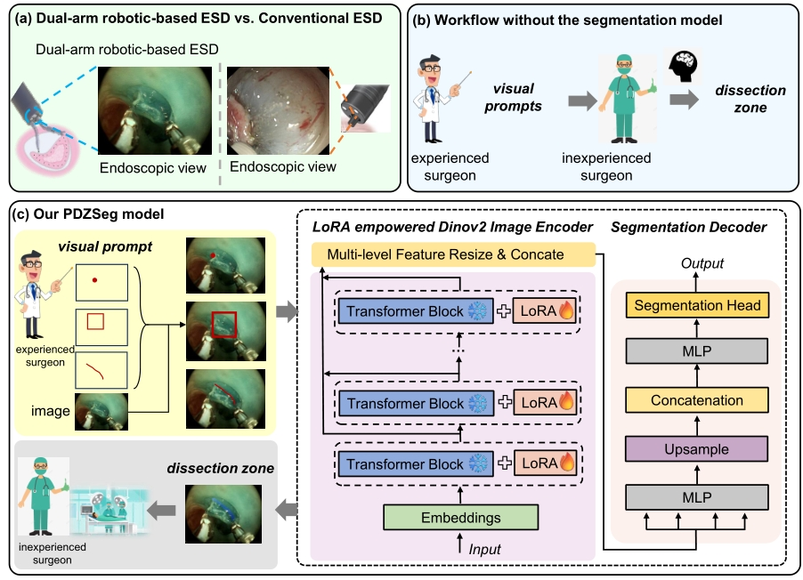

# PDZSeg: Adapting the Foundation Model for Dissection Zone Segmentation with Visual Prompts in Robot-assisted Endoscopic Submucosal Dissection



## Prerequisite

Make sure that you have downloaded `PyTorch` and `MMsegmentation`.

## Prepare dataset

Send email to mengyaxu@cuhk.edu.hk to request to download our **ESD-DZSeg** dataset from [here](https://drive.google.com/file/d/1obfmkU1P5Dlv2no7t1eJriy0fqw2ArOI/view?usp=sharing) and unzip it under the root directory of the project by

```**shell**
unzip ESD-DZSeg.zip
```

After unzipping, the folder structure should be as follows.

```tree
.
├── arch
├── dataset
├── log
├── utils
└── ...
```

The downloaded dataset only contains images without visual prompts, if you want to generate images with visual prompts(long scribble/ bounding box/  short scribble/ point), use the script under `utils/` including `draw_bbox.py`, `draw_point.py,` and `draw_longScribble.py`. Then it will generate the images with visual prompts under `./dataset/images_bbox/`,  `./dataset/images_point/ `, and `./dataset/images_longScribble/`, respectively.

## How to reproduce baseline using ESD-DZSeg

please refer to [mmseg_readme](./docs/mmseg_readme.md).

## How to train

if you want to train the model, use the following command.

```shell
python train_seg.py --prompt_type None --num_classes 2 --backbone_size base --decoder_type segformer --batch_size 8 --epoch 100 --init_lr 0.001 --crop_size 532 
```

If `prompt_type` is set to `None`, it will train the model using images without visual prompts. You can change it to `longScribble`, `shortScribble`, `bbox`, and `point` to train with with-prompt images.

## How to test and visualize

- **Test for metrics**

  If you only want the metric value(MIoU, IoU of each class, mDICE, DICE of each class) of the test set. Here is an example of testing without-prompt validation images.

  ```shell
  python test_seg.py \
  	--prompt_type None
  	--data_root ./dataset/
  	--checkpoint_path \PATH\TO\CHECKPOINT
  ```

  

- **Test for visualization**

    The visualization code is in `visualization_mask.py`, which overlays the mask on the raw image, and `visualization_contour.py`, which 
    overlays the contour of the mask on the raw image. Some important parameters are listed as follows.

    ```shell
    python visualization_mask.py \
        --prompt_image_dir \PATH\TO\IMAGE\FOLDER
        --clean_image_dir \PATH\TO\RAW_IMAGE\FOLDER
        --checkpoint_path \PATH\TO\CHECKPOINT
        --dst_folder \PATH\TO\SAVE\RESULTS
    ```

    `prompt_image_dir` is the path containing test images.

    `clean_image_dir` is the path of images without prompt, like images in `./dataset/images/validation`.  If not provided, the visualization results will be only the predictive segmentation masks without being overlaid on the raw images.

    `dst_folder` is the destination folder to store the visualization results. If not provided, it will be set as `./visualization` in default.


